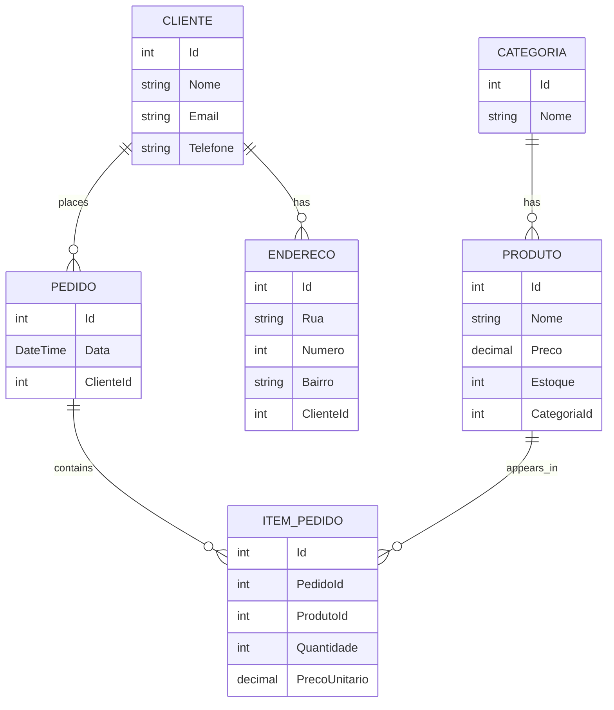

# ProdutosAPI

API REST em **ASP.NET Core** para gestão de produtos, categorias, clientes e pedidos, construída como projeto de estudo prático em C#/.NET, com foco em arquitetura de dados relacional, boas práticas de API e integração com RPA (UiPath) e front-end.

> Projeto desenvolvido durante o início do meu estágio em TI, como forma de praticar os conceitos de C#/.NET, Entity Framework Core, autenticação JWT e automação, aplicando-os num domínio de negócio real (vendas/estoque).

---

## Tecnologias utilizadas

- **ASP.NET Core Web API** (.NET 10)
- **Entity Framework Core** + **SQL Server (LocalDB)**
- **JWT (JSON Web Token)** para autenticação e autorização
- **BCrypt.Net** para hash seguro de senhas
- **xUnit** para testes automatizados
- **HTML + JavaScript puro** (fetch API) como front-end de consumo
- **UiPath Studio** para automação (RPA) consumindo a API

---

## Arquitetura de dados



### Tipos de relacionamento implementados

| Relação | Tipo | Observação |
|---|---|---|
| Categoria → Produto | Um-para-muitos | Chave estrangeira simples |
| Cliente → Endereço | Um-para-muitos | Rota aninhada (`/api/clientes/{clienteId}/enderecos`) — Endereço só existe no contexto de um Cliente |
| Pedido ↔ Produto | Muitos-para-muitos | Via tabela associativa `ItemPedido`, com dados próprios (Quantidade, PrecoUnitario) |

---

## Endpoints principais

| Método | Rota | Autenticação | Descrição |
|---|---|---|---|
| GET | `/api/Produtos` | Pública | Lista produtos com nome da categoria |
| POST | `/api/Produtos` | **JWT obrigatório** | Cria um produto |
| PUT / DELETE | `/api/Produtos/{id}` | **JWT obrigatório** | Edita / remove um produto |
| GET | `/api/Categorias` | Pública | Lista categorias |
| GET | `/api/Clientes` | Pública | Lista clientes com endereços |
| POST | `/api/clientes/{clienteId}/enderecos` | **JWT obrigatório** | Adiciona endereço a um cliente |
| POST | `/api/Pedidos` | **JWT obrigatório** | Cria um pedido com múltiplos itens |
| POST/PUT/DELETE | `/api/pedidos/{pedidoId}/itens` | **JWT obrigatório** | Gerencia itens de um pedido |
| POST | `/api/Auth/registrar` | Pública | Cria um novo usuário |
| POST | `/api/Auth/login` | Pública | Autentica e retorna um token JWT |

> A autorização segue o modelo: **leitura (GET) é pública**, **escrita (POST/PUT/DELETE) exige token JWT válido**.

---

## Decisões de design (e por quê)

**Preço "congelado" no pedido.** O campo `PrecoUnitario` é copiado do produto no momento da compra e nunca é recalculado depois — o preço de um produto pode mudar no catálogo sem alterar o valor histórico de pedidos já feitos.

**DTOs de entrada e saída.** Toda entidade com relacionamento bidirecional (ex.: `Pedido` ↔ `ItemPedido` ↔ `Produto`) tem um DTO de saída (`PedidoDTO`, `ProdutoDTO`) para evitar ciclos de serialização JSON, e os endpoints de criação de Pedido usam DTOs de entrada (`PedidoInputDTO`) que **não aceitam preço do cliente** — apenas `produtoId` e `quantidade`, por segurança e integridade.

**Validação de estoque com efeito colateral.** Ao criar um pedido, cada item é validado contra o estoque disponível (`400 Bad Request` se insuficiente) e, se aprovado, o estoque do produto é debitado na mesma transação (via tracking automático do Entity Framework — sem chamada explícita a `Update()`).

**Edição restrita por entidade.** Nem todo campo é editável via `PUT`: por exemplo, o `PrecoUnitario` de um item de pedido já confirmado não pode ser alterado, apenas a `Quantidade`; o `Pedido` só permite editar a `Data`, não o Cliente nem os Itens.

**Autenticação com JWT.** Senhas nunca são armazenadas em texto puro (hash via BCrypt). O token expira em 2 horas e carrega o login e o Id do usuário como *claims*.

---

## Como rodar o projeto

1. Clone o repositório e abra a solução no Visual Studio.
2. Ajuste a connection string em `appsettings.json` (usa SQL Server LocalDB por padrão).
3. No **Package Manager Console**, rode:
```powershell
   Update-Database
```
4. Rode o projeto (F5). A API sobe em `https://localhost:7264` (a porta pode variar).
5. Use o arquivo `ProdutosAPI.http` para testar os endpoints diretamente no Visual Studio.

### Fluxo de autenticação para testar rotas protegidas

```http
POST /api/Auth/login
{ "login": "admin", "senha": "senha123" }
```
Copie o `token` retornado e envie nas próximas requisições protegidas:
```http
Authorization: Bearer {token}
```

---

## Integrações

- **UiPath**: workflow que consome `GET /api/Pedidos`, deserializa o JSON e percorre pedidos e itens em loops aninhados, demonstrando consumo de API relacional via RPA.
- **Front-end (HTML/JS)**: páginas de listagem (produtos, pedidos) e cadastro (produto, com seleção dinâmica de categoria via `<select>` populado por `fetch`).

---

## Testes automatizados

Projeto `ProdutosAPI.Tests` (xUnit) cobrindo regras de negócio centrais, como a lógica de validação de estoque e cálculo de valor total do pedido.

---

## O que eu aprendi construindo isso

- Modelar e implementar os três tipos clássicos de relacionamento relacional (1:N, 1:N aninhado, N:N com tabela associativa).
- Resolver ciclos de serialização JSON com DTOs, separando modelo de persistência de modelo de resposta.
- Implementar autenticação JWT do zero (hash de senha, geração e validação de token, proteção seletiva de rotas).
- Depurar problemas reais de ambiente: cache de build desatualizado, conflitos de Foreign Key em migrations, CORS, binding redirects de assembly.
- Consumir a mesma API a partir de três "clientes" diferentes (arquivo `.http`, front-end JS, robô UiPath), reforçando que uma API bem desenhada é agnóstica de quem a consome.
